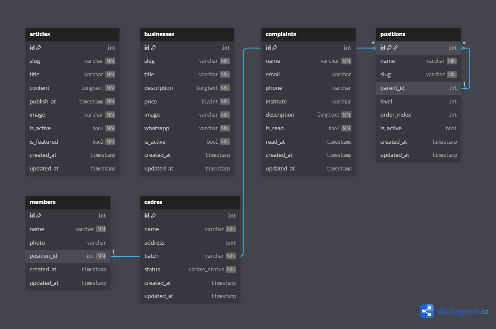

# HMJ TI BE

Backend API for the HMJ TI UINAM website and admin dashboard. This service provides public content endpoints for the website and authenticated management endpoints for administrators.

## Description

HMJ TI BE is a Laravel-based REST API for managing organization profile data, articles, businesses, complaints, positions, members, cadres, and dashboard summaries. It is designed to serve the public HMJ TI website and the HMJ TI admin application.

The API documentation is available at [https://ahmadikbaldjaya.github.io/hmj-ti-be/](https://ahmadikbaldjaya.github.io/hmj-ti-be/).

## Features

- Public APIs for about/profile data, articles, businesses, cadres, organizational structure, and complaint submission.
- Admin authentication using Laravel Sanctum personal access tokens.
- Admin dashboard summary endpoint.
- Authenticated global search endpoint for admin data across articles, businesses, positions, members, complaints, and cadres.
- CRUD management for articles, businesses, positions, members, cadres, and organization profile data.
- Complaint management with read/unread status and bulk deletion.
- Search, pagination, and filtering support for list endpoints.
- Image/file handling through Laravel storage.
- Database migrations, seeders, factories, feature tests, and OpenAPI validation support.

## Tech Stack

- PHP 8.1+
- Laravel 10
- Laravel Sanctum
- MySQL
- Composer
- Node.js and NPM
- Vite
- PHPUnit
- Hot Meteor Spectator / OpenAPI

## Installation

Clone the repository:

```bash
git clone https://github.com/AhmadIkbalDjaya/hmj-ti-be.git
cd hmj-ti-be
```

Install PHP dependencies:

```bash
composer install
```

Install JavaScript dependencies:

```bash
npm install
```

Create the environment file:

```bash
cp .env.example .env
```

For Windows PowerShell:

```powershell
Copy-Item .env.example .env
```

Generate the application key:

```bash
php artisan key:generate
```

Configure the database values in `.env`, then run migrations and seed the default data:

```bash
php artisan migrate --seed
```

Create the public storage link:

```bash
php artisan storage:link
```

Optional development seed data:

```bash
php artisan db:seed --class=DevSeeder
```

## Environment Variables

Variables used by this backend for local API development:

| Variable | Description |
| --- | --- |
| `APP_NAME` | Application name. |
| `APP_ENV` | Application environment, such as `local` or `production`. |
| `APP_KEY` | Laravel application encryption key. Generate it with `php artisan key:generate`. |
| `APP_DEBUG` | Enables or disables debug output. Use `false` in production. |
| `APP_URL` | Base URL of the application. |
| `DB_CONNECTION` | Database driver. The default is `mysql`. |
| `DB_HOST` | Database host. |
| `DB_PORT` | Database port. |
| `DB_DATABASE` | Database name. |
| `DB_USERNAME` | Database username. |
| `DB_PASSWORD` | Database password. |
| `LOG_CHANNEL` | Laravel logging channel. |
| `LOG_LEVEL` | Minimum log level. |
| `CACHE_DRIVER` | Cache driver. |
| `QUEUE_CONNECTION` | Queue driver. |
| `SESSION_DRIVER` | Session driver. |
| `FILESYSTEM_DISK` | Default filesystem disk. |
| `SPEC_SOURCE` | OpenAPI specification source for Spectator. |
| `SPEC_PATH` | Path to the OpenAPI documentation files. |

See `.env.example` for the default values.

## Running Locally

Start the Laravel development server:

```bash
php artisan serve
```

By default, the API will be available at:

```text
http://localhost:8000/api
```

Run the test suite:

```bash
php artisan test
```

Build the API documentation:

```bash
npm run build-api-docs
```

## Project Structure

```text
app/
  Enums/              Application enums.
  Exceptions/         Exception handling.
  Http/               Controllers, middleware, requests, and resources.
  Models/             Eloquent models.
  Providers/          Laravel service providers.
  Traits/             Shared response helpers.
bootstrap/            Laravel bootstrap files.
config/               Application configuration.
database/
  factories/          Model factories.
  migrations/         Database schema migrations.
  seeders/            Database seeders and seed data.
docs/                 API documentation and database documentation.
  index.html          Generated API documentation page.
  openapi.json        OpenAPI specification source.
  database/
    dbdiagram.txt     Database schema source for the diagram.
    dbdiagram.png     Rendered database relationship diagram.
lang/                 Localization files.
public/               Public entry point and publicly served assets.
resources/            CSS, JavaScript, and Blade resources.
routes/               Web, console, channel, and API route definitions.
storage/              Logs, cache, sessions, and uploaded files.
tests/                Feature and unit tests.
```

## Database Diagram



## Related Repository

- Backend API: [hmj-ti-be](https://github.com/AhmadIkbalDjaya/hmj-ti-be)
- Public website: [hmj-ti](https://github.com/AhmadIkbalDjaya/hmj-ti)
- Admin dashboard: [hmj-ti-admin](https://github.com/AhmadIkbalDjaya/hmj-ti-admin)
